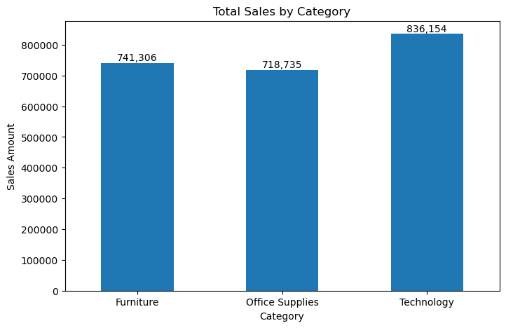
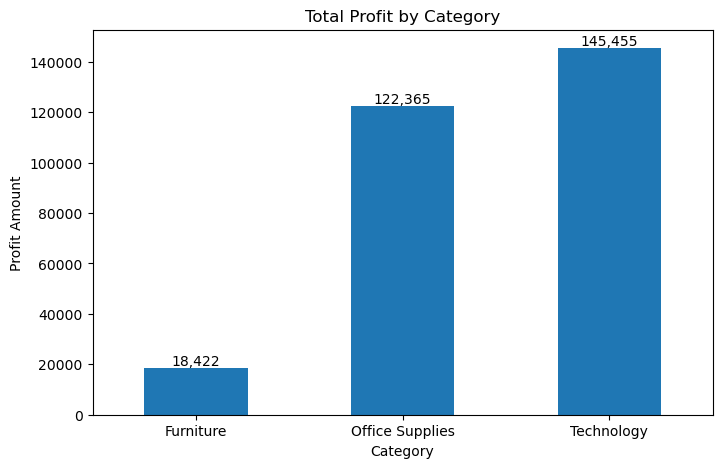
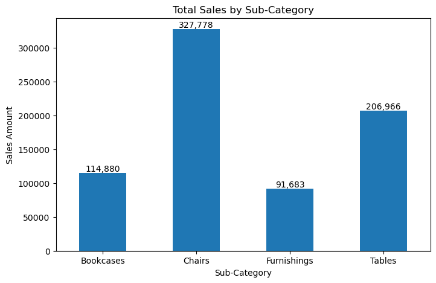
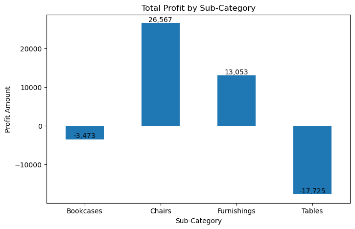
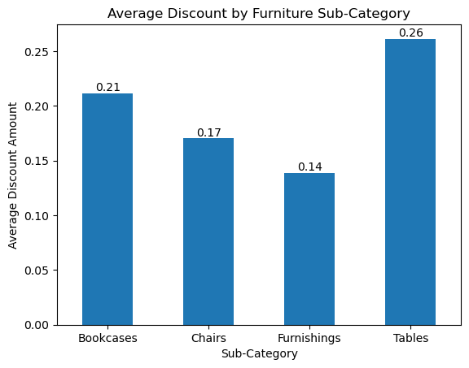
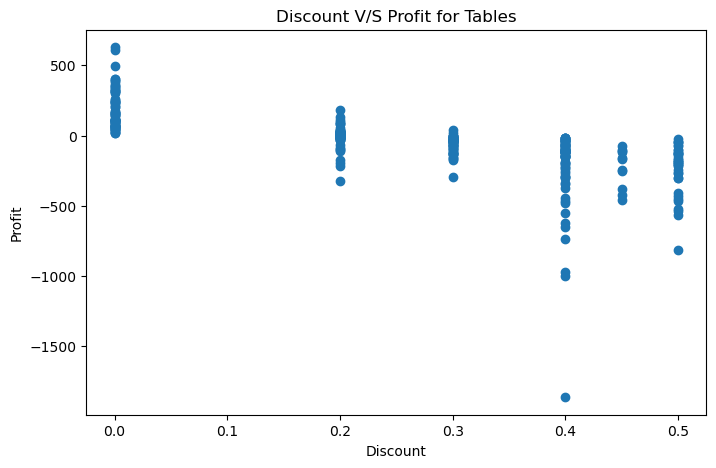

# 📊 Sample Superstore Exploratory Data Analysis

## CodeAlpha Data Analytics Internship Project


## 📌 Project Overview

This project performs Exploratory Data Analysis (EDA) on the Sample Superstore dataset to identify the key factors affecting business profitability.

The analysis focuses on understanding how different product categories, sub-categories, regions, customer segments, shipping modes, and discount levels influence profitability. Based on the findings, business insights and recommendations are provided to support data-driven decision making.


## 🎯 Business Problem

The company aims to understand the factors affecting profitability across different product categories, regions, customer segments, shipping modes, and discount levels. Although the business generates sales across multiple dimensions, profitability is not consistent.

This project investigates the major factors associated with lower profitability and provides business insights to support better decision-making.


## 🎯 Project Objectives

- Identify factors affecting profitability.
- Analyze profitability across product categories and sub-categories.
- Investigate the impact of discounts on profitability.
- Analyze profitability across different regions.
- Evaluate customer segment contribution to profitability.
- Examine profitability across different shipping modes.


## 🛠️ Technologies Used

- Python
- Pandas
- NumPy
- Matplotlib
- Seaborn
- SciPy
- Jupyter Notebook


## 📂 Project Workflow

1. Business Understanding
2. Dataset Understanding
3. Data Cleaning
4. Exploratory Data Analysis
5. Hypothesis Testing
6. Business Insights
7. Business Recommendations
8. Report Preparation


## 📈 Key Findings

- Technology generated the highest sales and profit.
- Furniture generated high sales but comparatively low profitability.
- Tables were the highest loss-making furniture sub-category.
- Higher discounts were associated with lower profitability.
- West region generated the highest profit, while East generated the lowest.
- Consumer segment contributed the highest profitability.
- Standard Class was the most profitable shipping mode.


## 📁 Repository Structure

```text
Sample-Superstore-EDA/
│
├── Dataset/
├── Images/
├── Notebook/
├── Report/
├── README.md
├── requirements.txt
└── LICENSE
```

## 👨‍💻 Author

**Saharsh Anant Sarde**

Aspiring Data Analyst | Python | SQL | Power BI | Data Visualization

If you found this project useful, feel free to ⭐ this repository.


## 💡 Business Recommendations

- Review the pricing and discount strategy for the Tables sub-category.
- Analyze the cost structure of Furniture products to improve profit margins.
- Evaluate discount policies to balance sales growth and profitability.
- Investigate the causes of low profitability in the East region.
- Develop targeted strategies for the Home Office customer segment.
- Review Same Day shipping costs and pricing to improve profitability.


## 📊 Project Visualizations

### Category Performance





### Furniture Sub-category Analysis





### Discount Impact Analysis






## 🚀 Future Improvements

- Build an interactive Power BI dashboard.
- Perform predictive analysis using Machine Learning.
- Analyze customer purchasing trends over time.
- Create automated business reports.


## ⚙️ Requirements

Install the required Python libraries:

```bash
pip install -r requirements.txt
```

## ⭐ Show Your Support

If you found this project helpful, consider giving this repository a ⭐.


